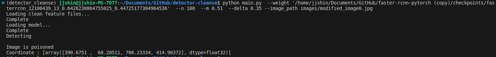
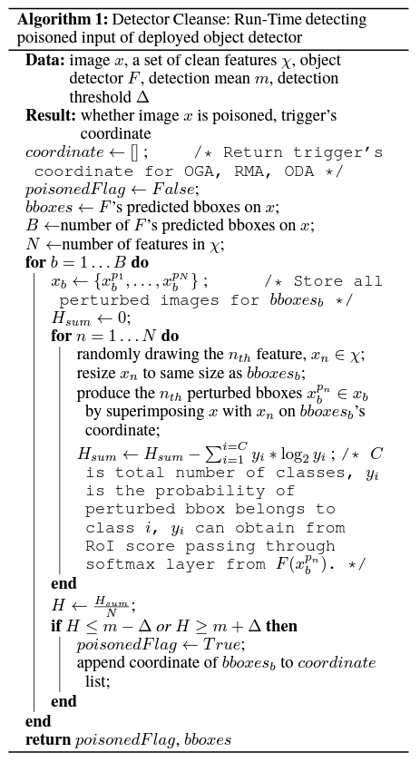

# Detector Cleanse

This repository contains an unofficial implementation of Detector Cleanse, complementing the object detection models by identifying potentially poisoned inputs. The implementation is based on the algorithm introduced in the paper [BadDet: Backdoor Attacks on Object Detection](https://arxiv.org/abs/2205.14497).


<br /><br />


## Getting Started

To use this tool, first download the clean feature images. These images are used by the Detector Cleanse algorithm to determine if an input image has been tampered with.
<br />

### Download Clean Feature Images

The clean feature images used in this repository are composed of bounding box regions from the VOC2007 dataset's test set, converted into images. You can either create your own folder of JPG images as clean feature images or use the prepared set, which contains approximately 15,000 images.

You can download the prepared clean feature images from the following link:
[Clean Feature Images](https://drive.google.com/file/d/1Qj_5s84HXdgDWG3KRn-zW7oIRGvrouer/view?usp=sharing)

Alternatively, you can use the following commands in your bash terminal to download and unzip the clean feature images:

```bash
pip install gdown
gdown https://drive.google.com/file/d/1Qj_5s84HXdgDWG3KRn-zW7oIRGvrouer/view?usp=sharing
unzip clean_feature_images.zip
```
This will download and extract the clean_feature_images.zip file, containing the images needed for the Detector Cleanse process.
<br />

### Setting up the Environment

Ensure Python is installed along with the necessary packages.
```bash
pip install pytorch
pip install visdom scikit-image tqdm fire ipdb pprint matplotlib torchnet

```
start visdom for visualization
```Bash
nohup python -m visdom.server &
```

### Usage

To run the Detector Cleanse, use the following command-line arguments:

- `--n`: Number of features to randomly select from the clean feature images.
- `--m`: Detection mean for identifying poison.
- `--delta`: Detection threshold for identifying poison.
- `--image_path`: Path to the image that needs to be analyzed.
- `--clean_feature_path`: Path to the clean feature image folder. Default is 'clean_feature_images'.
- `--weight`: Path to the weight file of the model.

```bash
python main.py --n 100 --m 0.51 --delta 0.25 --image_path 'path/to/image.jpg' --clean_feature_path 'path/to/clean_feature_images' --weight 'path/to/model/weight.pth'
```
<br />

### Additional Customization

Since this implementation of Detector Cleanse is based on a specific repository ([simple-faster-rcnn-pytorch](https://github.com/chenyuntc/simple-faster-rcnn-pytorch/tree/master)), additional modifications might be necessary to test it with your own model. To accommodate different object detection models or different setups, you may need to make changes in the code.

For detailed instructions on how to customize this implementation for your specific needs, please refer to the [Customization Guide](CustomizationGuide.md).
<br /><br />

## :)

We acknowledge the use of code from the [simple-faster-rcnn-pytorch](https://github.com/chenyuntc/simple-faster-rcnn-pytorch/tree/master) repository, specifically for defining the Faster R-CNN model. This part of the code is borrowed under the terms of the MIT License of the original repository. We have adapted and extended it for our purposes. See [LICENSE](https://github.com/chenyuntc/simple-faster-rcnn-pytorch/blob/master/LICENSE) in the original repository for more details.

We welcome contributions to this project! If you have suggestions for improvements or want to contribute code, please feel free to open an issue or a pull request.

This project is licensed under the MIT License - see the [LICENSE](LICENSE) file for details.
<br /><br />

### Algorithm

The image below represents the Detector Cleanse algorithm as outlined in the BadDet Appendix.


